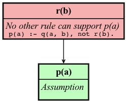
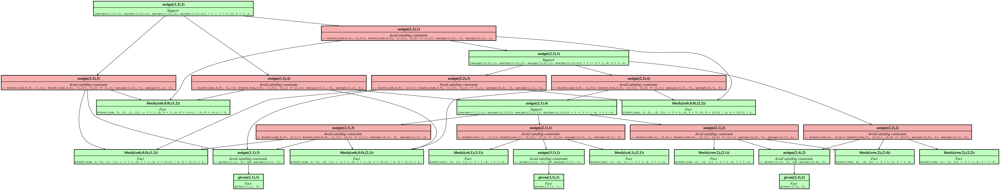

# ucorexplain


## Installation

Requires Python 3.11 or grater

```shell
pip install .
```

## Usage

```shell
ucorexplain -h
```


  **Restricted fragment**

  - No aggregates
  - No show statements

### Run paper example

The user can first run `clingo` to get a result for the program with

```shell
clingo examples/basic/paper.lp
```

```
pyclingo version 5.7.1
Reading from examples/basic/paper.lp
Solving...
Answer: 1
q(a,b) q(b,a) p(a) r(a)
SATISFIABLE
```

Then you might want to know why `r(b)` is not part of the answer.

```
ucorexplain --prg examples/basic/paper.lp -q "r(b)" -a "q(a,b). q(b,a). p(a). r(a)." --view
```




### Run Sudoku example

The sudoku example can be ran in two ways

#### Via command line

```shell
ucorexplain --prg examples/sudoku/encoding.lp --prg examples/sudoku/instance4x4.lp  -q "assign((1,2),2)" -a "assign((2,2),1). assign((1,3),1). assign((3,1),1). assign((4,4),1). assign((1,2),2). assign((2,4),2). assign((4,1),2). assign((3,3),2). assign((1,1),3). assign((2,3),3). assign((4,2),3). assign((3,4),3). assign((2,1),4). assign((1,4),4). assign((3,2),4). assign((4,3),4)." --view
```



#### As an API

This option allows to reorder the rules and expand them

```shell
python examples/api/sudoku.py
```
