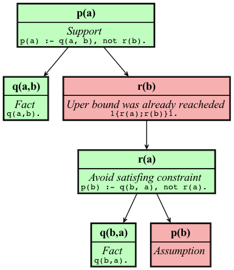

# ucorexplain


## Installation

Requires Python 3.11 or grater

```shell
pip install .
```

## Usage

```shell
ucorexplain -h
```


  **Restricted fragment**

  - No aggregates
  - No show statements

### Run paper example 5

The user can first run `clingo` to get a result for the program with

```shell
clingo examples/paper/example5.lp
```

```
pyclingo version 5.7.1
Reading from examples/paper/example5.lp
Solving...
Answer: 1
s(a,b) s(b,a) p(a) r(a)
SATISFIABLE
```

Then you might want to know why `p(a)` is part of the answer.

```shell
ucorexplain --prg examples/paper/example5.lp -q "p(a)." -a "s(a,b). s(b,a). p(a). r(a)." --view
```




### Run paper example 8

The user can first run `clingo` to get a result for the program with

```shell
clingo examples/paper/example8.lp
```

```
pyclingo version 5.7.1
Reading from examples/paper/example8.lp
Solving...
Answer: 1

SATISFIABLE
```

Then you might want to know why `r` is not part of this empty answer set.

```shell
ucorexplain --prg examples/paper/example8.lp -q "r." -a "" -f "p." --view --verbose
```

This will output a graph with the single constraint needed, as well as all intermediate steps (because of `--verbose`).
This steps will show that the single needed rule is the one marked with objective atom `__pus__(program,2).`
We encourage you to read the paper to understand this output better. 


### Run Sudoku example

The sudoku example can be ran in two ways

#### Via command line

```shell
ucorexplain --prg examples/sudoku/encoding4x4.lp --prg examples/sudoku/instance4x4.lp  -q "assign((1,2),2)." -a "assign((2,2),1). assign((1,3),1). assign((3,1),1). assign((4,4),1). assign((1,2),2). assign((2,4),2). assign((4,1),2). assign((3,3),2). assign((1,1),3). assign((2,3),3). assign((4,2),3). assign((3,4),3). assign((2,1),4). assign((1,4),4). assign((3,2),4). assign((4,3),4)." --view
```


This graph can also be shown as a tree with repeated nodes by changing `--view` for  `--view-tree` 


#### As an API

This option allows to reorder the rules and expand them. It opens the navigator

```shell
python examples/api/sudoku.py
```
